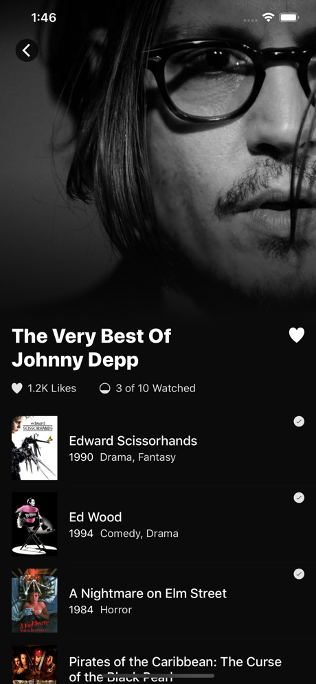
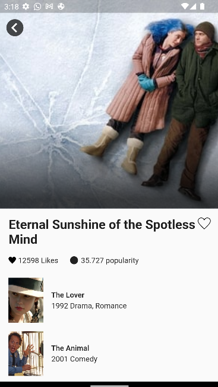

# Índice

- [Sobre](#sobre)
- [Desafios](#desafios)
- [Como Contribuir](#como-contribuir)

## :bookmark: Sobre

O <strong>TodoMovie</strong> é uma aplicação Mobile usada como requisito de etapa técnica na empresa <strong>STARTAIDEIA</strong>

## :books: Desafios

- Usar Clean architecture.
- Usar algum package de gerenciamento de estado, como: Getx, Bloc, MobX, Provider etc.(Se possível utilizar Getx).
- As informações do filme devem vir do endpoint [/movie](https://developers.themoviedb.org/3/movies/get-movie-details).
- Usar o "vote_count" que é retornado pelo endpoint acima para representar o número de likes.
- Substituir o texto "3 of 10 watched" (ver tela de exemplo no tópico "Layout") por "popularity_view". O "popularity" a ser usado é o campo retornado pelo endpoint [/movie](https://developers.themoviedb.org/3/movies/get-movie-details). Mantenha o ícone que já está na tela de exemplo.
- O ícone de like (coração) deve mudar quando clicado, alternando entre preenchido e vazio.
- Deve haver uma lista de filmes abaixo dos detalhes.
- O projeto deve ser disponibilizado em um repositório aberto no GitHub. Envie a URL assim que
  possível.

## :heavy_check_mark: :iphone: Resultado Mobile

<h1 align="center">
    
    
</h1>

## :recycle: Como contribuir

- Faça um Fork desse repositório,
- Crie uma branch com a sua feature: `git checkout -b my-feature`
- Commit suas mudanças: `git commit -m 'feat: My new feature'`
- Push a sua branch: `git push origin my-feature`
